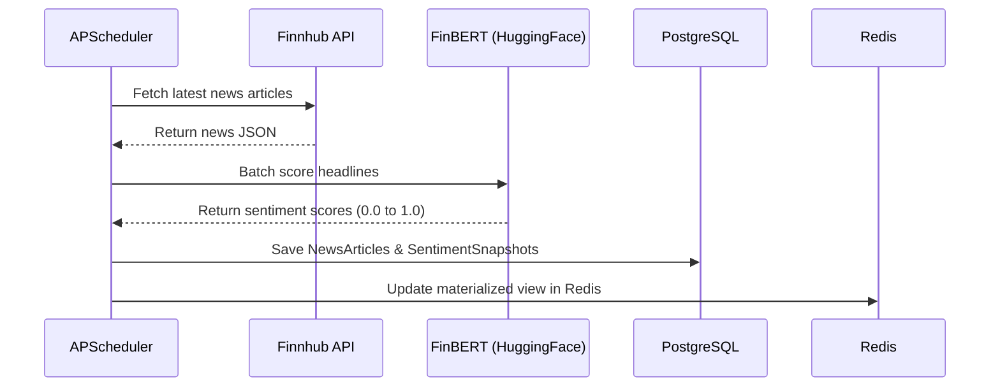
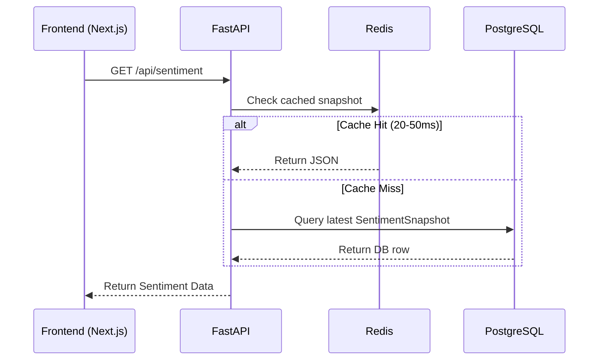
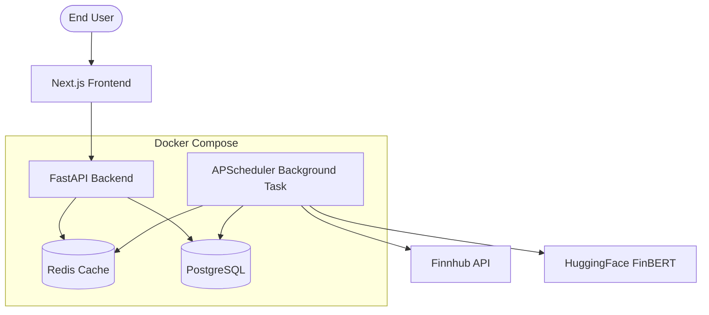

# FinRadar: Market Intelligence Data Platform

FinRadar is a scheduled, high-performance market intelligence data platform. It continuously ingests financial news, scores market sentiment using FinBERT (NLP), and stores lineage-aware analytical snapshots to serve low-latency insights via a Redis-backed API.

## The Problem
Market intelligence systems often perform expensive NLP analysis synchronously during user requests. This creates massive latency spikes (up to 40 seconds) and tightly couples data ingestion with API serving, making the platform fragile and unscalable.

## The Solution (V2 Architecture)
FinRadar solves this by decoupling ingestion from serving. A scheduled background pipeline handles the heavy lifting of fetching data and running ML inference, while the user-facing API simply reads pre-computed snapshots from a Redis cache.

### Scheduled Ingestion Flow

### User Read Flow

## Production Metrics
By migrating to this architecture, FinRadar achieves enterprise-grade performance:
- **Pipeline Execution**: ~238 seconds per run
- **Throughput**: ~80 articles processed per run
- **Cache Hit Latency**: 20ms - 50ms (Down from 8-40 seconds)
- **Availability**: 100% decoupling from upstream Finnhub rate limits during user requests.

## Deployment Architecture

## Migration Story & Feature Flags
This platform evolved from a simplistic request-driven architecture (V1) to a robust background-pipeline architecture (V2).

To safely migrate production traffic without downtime, the V2 read paths were introduced behind a feature flag: `USE_V2_READ_PATH=true`. This allowed us to shadow-deploy the background pipeline, verify the data integrity in PostgreSQL, and instantly switch API reads over to the new schema with zero rollback risk.

## Internal Scripts
Note: You may find `do_refactor.py` and `do_phase4c.py` inside `backend/scripts/`. These are internal migration scripts used during the architectural refactoring phase to migrate the codebase and test the transition.

## Architecture Decision Records (ADR)
For detailed insights into the engineering trade-offs made during the design of FinRadar, please refer to our ADRs in `docs/adr/`:
- **ADR-001**: Why APScheduler instead of Celery
- **ADR-002**: Why Snapshot Architecture
- **ADR-003**: Why Redis Cache
- **ADR-004**: Why Feature Flags
